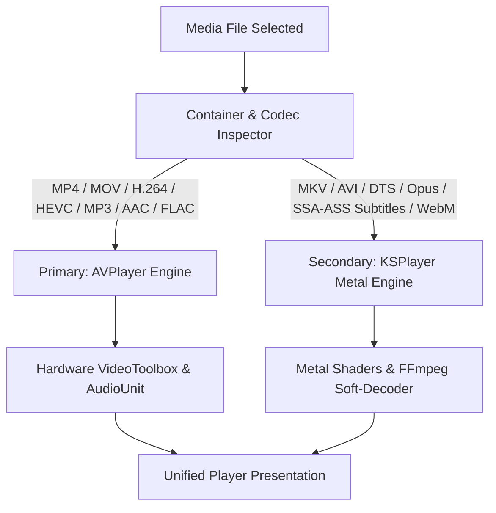
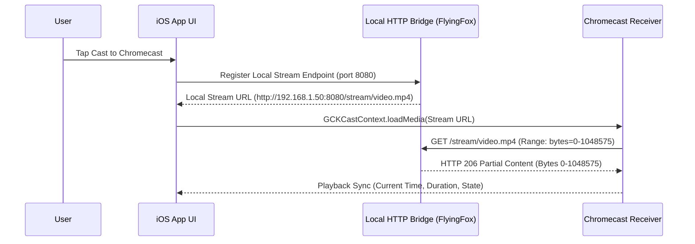

# SYSTEM ARCHITECTURE & MEDIA ENGINE SPECIFICATION

## 1. System Overview
The application is a high-performance, offline-first personal media player engineered for **iOS 18.0+ and iPadOS 18.0+** using **Swift 6 and SwiftUI**. It provides a unified, battery-efficient engine for playing local audio/video, streaming via **AirPlay 2** and **Chromecast**, managing files in-app and via the iOS Files app, and exploring web-based media streams.

### 1.1 Target Hardware & OS Profiles
- **Primary iPhone Target**: **iPhone 11 (iOS 18.7.7)**
  - *Hardware Profile*: Apple A13 Bionic, 4GB RAM, 6.1" Liquid Retina (Notch / Safe Area layout).
  - *Engineering Priority*: Strict memory footprint discipline (< 100MB active) during large library indexing and FLAC/MKV soft-decoding to avoid Jetsam terminations; full support for portrait/landscape notch safe areas.
- **Primary iPadOS Target**: **iPad Air 5th Gen (iPadOS 18.7.8)**
  - *Hardware Profile*: Apple Silicon M1 (8-core CPU/GPU, 8GB RAM), 10.9" Liquid Retina.
  - *Engineering Priority*: Stage Manager fluid multi-window resizing, 3-column `NavigationSplitView`, hardware-accelerated Metal video rendering, and USB-C direct external drive (SSD/Flash) indexing via security-scoped bookmarks.

```mermaid
graph TB
    subgraph UI_Layer [Presentation Layer - SwiftUI]
        MainWindow[NavigationSplitView / Main Tabs]
        AudioModal[Studio Audio Player Modal]
        VideoOverlay[120Hz Gesture Video Player]
        MiniPlayer[Floating Glass Mini-Player Dock]
        BrowserTab[WKWebView Media Stream Sniffer]
        CastSheet[AirPlay & Cast Route Picker]
    end

    subgraph Service_Layer [Coordinator & Services Layer]
        PlaybackCoordinator[Playback Coordinator]
        FileManagerService[File Ingestion & Sandbox Manager]
        CastBridgeService[Chromecast HTTP 206 Bridge & AirPlay]
        DownloadManager[Background URLSession Downloader]
        DatabaseService[SQLite / GRDB Storage Service]
    end

    subgraph Engine_Layer [Media Execution Engines]
        AVPlayerAdapter[AVPlayer Engine (Hardware Accelerated)]
        KSPlayerAdapter[KSPlayer / Metal Engine (Universal Codecs)]
        EmbeddedHTTPServer[Embedded HTTP Server (FlyingFox)]
        MetadataExtractor[AVAsset & ID3 Tag Parser]
    end

    subgraph Storage_Layer [Storage & OS Integration]
        AppSandbox[App Documents / iOS Files App]
        SQLiteDB[(my_project.sqlite Database)]
        SecurityBookmarks[Security-Scoped Bookmark Provider]
        SystemNowPlaying[MPNowPlayingInfoCenter & RemoteCommand]
    end

    UI_Layer --> Service_Layer
    Service_Layer --> Engine_Layer
    Engine_Layer --> Storage_Layer
    Service_Layer --> Storage_Layer
```

---

## 2. Dual Playback Engine Architecture

### 2.1 Playback Protocol Abstraction
To keep UI components decoupled from specific playback frameworks, all player interactions conform to `MediaPlayerProtocol`:

```swift
// [Intent] Common playback protocol decoupling SwiftUI views from underlying decoder engines
protocol MediaPlayerProtocol: AnyObject {
    var state: PlaybackState { get }
    var currentPosition: TimeInterval { get }
    var duration: TimeInterval { get }
    var volume: Float { get set }
    var playbackRate: Float { get set }
    var currentItem: MediaItem? { get }
    
    func load(item: MediaItem) async throws
    func play()
    func pause()
    func seek(to position: TimeInterval)
    func setSubtitleTrack(index: Int)
    func setAudioTrack(index: Int)
    func releaseResources()
}
```

### 2.2 Adaptive Engine Routing Logic


1. **Primary Engine (AVPlayer / AVFoundation)**:
   - Zero-copy hardware decoding for Apple-native formats.
   - Lowest possible battery consumption.
   - Native Picture-in-Picture (`AVPictureInPictureController`) and native AirPlay 2 video streaming.
2. **Secondary Engine (KSPlayer / Metal + FFmpeg)**:
   - Pure Swift wrapper around FFmpeg and libass with Metal shader rendering.
   - Full support for `.mkv`, `.avi`, `.webm`, DTS audio, and advanced SSA/ASS subtitle styling.
   - Picture-in-Picture supported via `AVSampleBufferDisplayLayer` bridge.

---

## 3. Storage, File Ingestion & Database Architecture

### 3.1 File Ingestion Channels
- **iOS Files App Integration**: Enabled via `UIFileSharingEnabled = true` and `LSSupportsOpeningDocumentsInPlace = true` in `Info.plist`. Files placed in the app's folder are automatically indexed.
- **Embedded Wi-Fi Web Transfer**: Local HTTP web interface allowing desktop browser drag-and-drop file upload (`http://<device-ip>:8080`).
- **External Storage / USB**: `UIDocumentPickerViewController` with security-scoped resource bookmarks.

### 3.2 Database Schema (SQLite / GRDB)
```sql
CREATE TABLE IF NOT EXISTS media_items (
    id TEXT PRIMARY KEY,
    title TEXT NOT NULL,
    file_path TEXT NOT NULL UNIQUE,
    file_name TEXT NOT NULL,
    file_size INTEGER NOT NULL,
    duration REAL DEFAULT 0.0,
    media_type TEXT NOT NULL, -- 'audio' or 'video'
    container_format TEXT NOT NULL, -- 'mp4', 'mkv', 'mp3', 'flac'
    codec TEXT,
    artwork_path TEXT,
    artist TEXT,
    album TEXT,
    genre TEXT,
    track_number INTEGER,
    last_played_at INTEGER,
    playback_position REAL DEFAULT 0.0,
    is_favorite INTEGER DEFAULT 0,
    waveform_data BLOB,
    created_at INTEGER NOT NULL,
    updated_at INTEGER NOT NULL
);

CREATE TABLE IF NOT EXISTS playlists (
    id TEXT PRIMARY KEY,
    name TEXT NOT NULL,
    created_at INTEGER NOT NULL,
    updated_at INTEGER NOT NULL
);

CREATE TABLE IF NOT EXISTS playlist_items (
    playlist_id TEXT NOT NULL,
    media_id TEXT NOT NULL,
    sort_order INTEGER NOT NULL,
    PRIMARY KEY (playlist_id, media_id),
    FOREIGN KEY (playlist_id) REFERENCES playlists(id) ON DELETE CASCADE,
    FOREIGN KEY (media_id) REFERENCES media_items(id) ON DELETE CASCADE
);

CREATE TABLE IF NOT EXISTS bookmarks (
    id TEXT PRIMARY KEY,
    media_id TEXT NOT NULL,
    position REAL NOT NULL,
    title TEXT,
    created_at INTEGER NOT NULL,
    FOREIGN KEY (media_id) REFERENCES media_items(id) ON DELETE CASCADE
);
```

---

## 4. Casting & Streaming Architecture

### 4.1 AirPlay 2
- Handled natively through `AVRoutePickerView` and standard `AVPlayerItem` routing.

### 4.2 Google Cast (Chromecast) Local HTTP Range Bridge
Chromecast devices cannot read iOS sandbox files directly. The app runs a background HTTP server serving byte ranges:



---

## 5. In-App Web Browser & Stream Sniffer
- Implemented via `WKWebView` with injected JavaScript hooks.
- Detects HTML5 `<video>`, `<audio>`, `.m3u8` (HLS), and MP4 streaming endpoints.
- Actions available: **"Play in App"**, **"Cast to TV"**, and **"Background Download"** (via `URLSessionConfiguration.background`).
