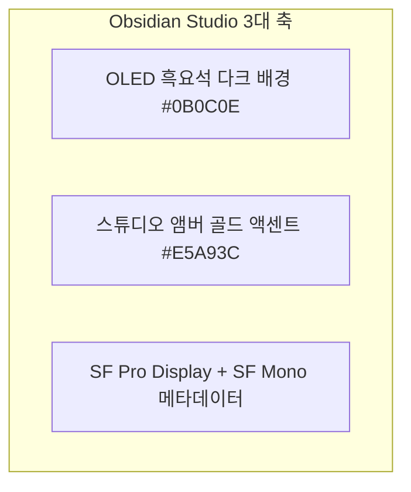

# DESIGN SYSTEM & UI/UX SPECIFICATION: OBSIDIAN STUDIO

## 1. Design Philosophy
**Obsidian Studio** is a professional dark design system engineered for media consumption on iOS and iPadOS. Deep obsidian and pure black OLED surfaces retreat into the background, letting album artwork, video frames, and waveforms take visual prominence.

---

## 2. Design Tokens & Color Palette

| Token Name | Hex Code | RGB / HSL | Usage |
| :--- | :--- | :--- | :--- |
| **`obsidian.background`** | `#0B0C0E` | `rgb(11, 12, 14)` | Primary background (OLED energy saving) |
| **`obsidian.surface`** | `#14161A` | `rgb(20, 22, 26)` | List rows, sidebar background, table containers |
| **`obsidian.elevated`** | `#1E2127` | `rgb(30, 33, 39)` | Cards, floating mini-player, modal sheets |
| **`obsidian.border`** | `#282C35` | `rgb(40, 44, 53)` | 0.5pt subtle hairline dividers and card outlines |
| **`studio.amber`** | `#E5A93C` | `hsl(39, 78%, 56%)` | Active play state, scrubber thumb, active tab |
| **`studio.slate`** | `#8E95A5` | `hsl(224, 11%, 60%)` | Inactive icons, secondary controls, track durations |
| **`text.primary`** | `#FFFFFF` | `rgb(255, 255, 255)` | Media titles, primary headers, active label |
| **`text.secondary`** | `#9AA0AC` | `rgb(154, 160, 172)` | Artist names, album titles, subtitle text |
| **`text.tertiary`** | `#636B78` | `rgb(99, 107, 120)` | File sizes, container extensions, timestamps |
| **`status.success`** | `#30D158` | `rgb(48, 209, 88)` | AirPlay / Chromecast connected, download complete |

---

## 3. Typography System

| Style Token | Font Family | Size / Weight | Purpose |
| :--- | :--- | :--- | :--- |
| **`Header.Large`** | SF Pro Display | 28pt Bold | Library view titles, section headers |
| **`Header.Section`** | SF Pro Display | 20pt Semibold | Playlist titles, video overlay title |
| **`Body.Primary`** | SF Pro Text | 16pt Medium | Media item titles, navigation labels |
| **`Body.Secondary`** | SF Pro Text | 14pt Regular | Artist, Album, container format badges |
| **`Mono.Timecode`** | SF Pro Mono | 13pt Medium | Elapsed & remaining timecodes (zero jitter) |
| **`Mono.AudioSpec`** | SF Pro Mono | 11pt Semibold | Codec tags: `FLAC 24bit/96kHz`, `HEVC 4K HDR` |

---

## 4. Screen Layouts & Component Specifications

### 4.1 iPhone Ergonomics & Navigation
- **Bottom Tab Bar**: Translucent Material with tabs: Library, Files, Browser, Cast & Shares, Settings.
- **Floating Mini-Player**: Docks right above the tab bar. Includes album art, title/artist, play/pause toggle, and 1.5pt Studio Amber progress bar. Expands via `matchedGeometryEffect` into the Fullscreen Player.

### 4.2 iPadOS 3-Column NavigationSplitView
1. **Primary Sidebar (280pt)**: Media Collections, Playlists, Wi-Fi Transfer, Test Server.
2. **Content Column**: Media Grid / List with rich metadata badges and sort/filter bar.
3. **Inspector Column (320pt)**: Metadata, embedded audio/subtitle tracks, bitrate info, waveform visualizer.

---

## 5. Player Interaction Details
- **Video Player**: 120Hz ProMotion swipe gestures (left: brightness HUD, right: volume HUD), horizontal timeline scrubbing with 1-second frame thumbnails, double-tap 10s skip ripple, Picture-in-Picture.
- **Audio Player**: Dynamic ambient cover-art glow, 100-bar interactive waveform scrubber, auto-scrolling synced lyrics sheet, 10-band graphic equalizer curve.
- **Wi-Fi Web Transfer Page**: Obsidian Studio dark web page, drag-and-drop folder upload zone, real-time chunked progress bars.
