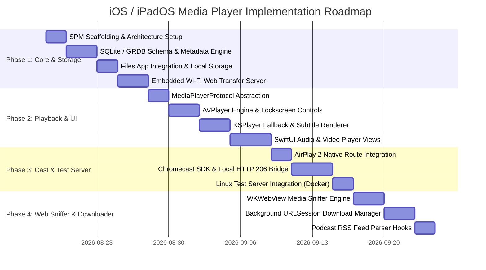

# PRODUCT STRATEGY & IMPLEMENTATION ROADMAP

## 1. Competitive Benchmark & Differentiators

| Feature Dimension | Our App | Evermusic | VLC for iOS | Infuse |
| :--- | :--- | :--- | :--- | :--- |
| **Primary Focus** | **Unified Audio & Video** | Audio & Music | Universal Video/Audio | Premium Video |
| **Playback Engine** | **Dual (AVPlayer + KSPlayer/Metal)** | AVPlayer (Audio) | MobileVLCKit (C/C++) | Custom Metal/FFmpeg |
| **Battery Efficiency** | ⭐⭐⭐⭐⭐ Adaptive HW routing | ⭐⭐⭐⭐⭐ High | ⭐⭐⭐ Moderate | ⭐⭐⭐⭐ High |
| **Format Support** | Universal (MP4, MKV, FLAC, DTS, ASS) | Standard Audio/Video | Universal | Universal Video |
| **Chromecast Support** | Embedded Local HTTP Bridge (206 Range) | Limited | Built-in | Built-in |
| **In-App Web Browser** | Media Sniffer + Stream Caster | ❌ None | ❌ None | ❌ None |
| **Wi-Fi Web Transfer** | Glassmorphic Drag & Drop + QR Code | Basic Web Upload | Basic Web Upload | WebDAV/SMB link |

---

## 2. Baseline Superiority & UX Strategy

---

## 3. Four-Phase Concrete Execution Roadmap

### Phase 1: Core Foundation & Ingestion
- **Deliverables**:
  - Modular Swift Package structure (`CoreStorage`, `MetadataEngine`, `TransferServer`, `FileManagerCore`).
  - SQLite/GRDB schema for media items, playlists, bookmarks, and waveform blobs.
  - `AVAsset` / ID3 async metadata parser & waveform cache generator.
  - iOS Files app integration (`UIFileSharingEnabled`) and Security-Scoped Bookmarks.
  - Embedded `FlyingFox` Wi-Fi Web Transfer server with QR code connect.
- **Loop Out Criteria (DoD - Phase 1 Exit Gate)**:
  1. `CoreStorage`: All GRDB CRUD, relational playlist queries, and full-text search unit tests pass 100%.
  2. `MetadataEngine`: Async metadata parsing for 100 sample files (MP3, FLAC, MP4, MKV) completes without memory leaks or UI thread blocking.
  3. `TransferServer`: Web drag-and-drop uploads of files up to 2GB and nested directories succeed with 100% integrity across 10 concurrent chunks.
  4. `FileManagerCore`: File drop into App Documents folder auto-indexes into SQLite in < 500ms.

### Phase 2: Playback Engines & Player UI
- **Deliverables**:
  - `MediaPlayerProtocol` common interface.
  - `AVPlayer` primary adapter with `AVAudioSession` (.playback) and `MPNowPlayingInfoCenter`.
  - `KSPlayer` (Metal + FFmpeg) fallback adapter for MKV, DTS, and SSA/ASS subtitles.
  - 120Hz ProMotion video player overlay (brightness/volume HUD, 1s thumbnail scrub, PiP).
  - Studio audio player modal (waveform scrubber, synced lyrics sheet, 10-band EQ).
- **Loop Out Criteria (DoD - Phase 2 Exit Gate)**:
  1. `AVPlayer`: MP4/MP3 startup time < 200ms with zero dropped frames.
  2. `KSPlayer Fallback`: MKV video with stylized ASS/SSA subtitles renders with accurate fonts, positions, and styling.
  3. `Lifecycle & Background`: Screen lock, Siri interruption, and AirPods disconnect/reconnect handled cleanly without crashes or lost state.
  4. `Memory & Performance`: Continuous 60-minute audio playback maintains stable memory footprint (< 100MB) with no retain cycles.

### Phase 3: Casting & Test Server Integration
- **Deliverables**:
  - `AVRoutePickerView` native AirPlay 2 integration.
  - Google Cast iOS SDK integration with local HTTP 206 partial content streaming bridge.
  - Linux test server validation (Nginx Range streaming, WebDAV, mock RSS podcasts).
- **Loop Out Criteria (DoD - Phase 3 Exit Gate)**:
  1. `AirPlay 2`: Audio and video route transitions complete in < 1.5s with perfect A/V lip-sync.
  2. `Chromecast HTTP Bridge`: Local sandbox files cast to Google Cast device with zero buffering stutters and immediate seek response (HTTP 206 verified).
  3. `Test Server`: All 3 Docker services (Stream :8081, WebDAV :8082, Podcast :8083) verified and accessible over local LAN.

### Phase 4: In-App Browser & Background Downloader
- **Deliverables**:
  - `WKWebView` browser tab with injected stream-sniffing JavaScript.
  - Unobtrusive floating pill UI with [Play], [Cast], [Download] actions.
  - `URLSessionConfiguration.background` download queue with auto-indexing.
  - Modular hooks for Podcast RSS 2.0 / iTunes XML feeds.
- **Loop Out Criteria (DoD - Phase 4 Exit Gate)**:
  1. `Media Sniffer`: Accurately detects HLS (.m3u8) and MP4 video streams within < 500ms of page load.
  2. `Background Downloader`: Downloads continue when app is backgrounded or suspended, auto-indexing on completion.
  3. `End-to-End Release Gate`: Complete user flow (Download from Web -> Organize in Playlist -> Play locally with EQ -> Cast to TV) verified with zero critical defects.
