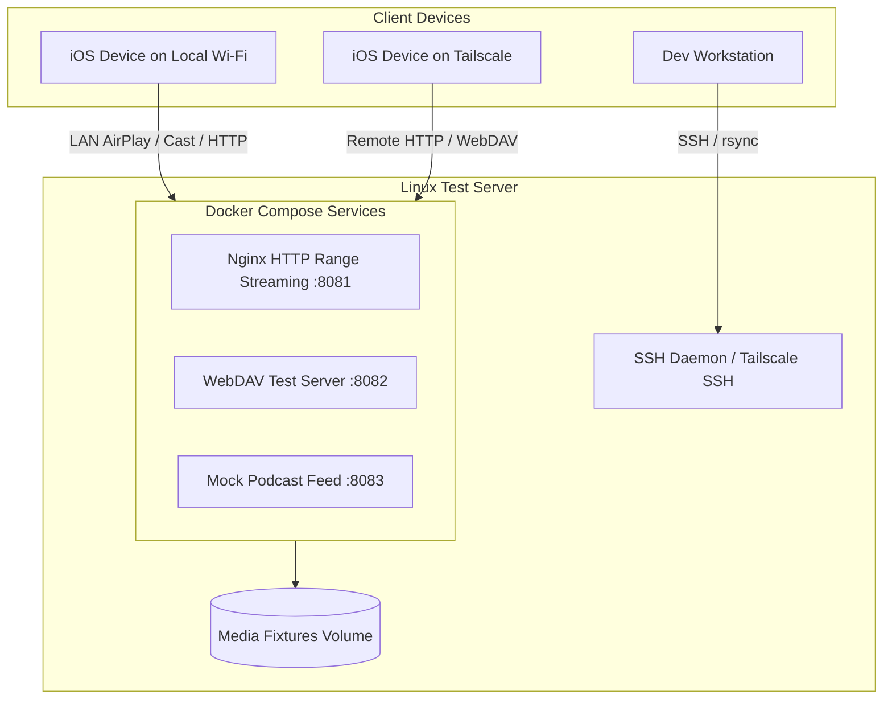

# TEST SERVER ARCHITECTURE & INTEGRATION GUIDE

## 1. Overview
The Linux test server supplies real-world fixtures for HTTP Range media streaming, WebDAV remote file browsing, and mock podcast feeds during iOS/iPadOS client development.



---

## 2. Network Topology & Discovery Rules

### 2.1 LAN vs. Tailscale Connectivity
- **Local LAN (Physical Wi-Fi)**:
  - **Required** for Google Cast (Chromecast) and Apple AirPlay end-to-end device discovery due to mDNS / SSDP multicast layer-2 constraints.
- **Tailscale Mesh VPN**:
  - Used for remote media streaming, off-LAN WebDAV browsing, automated fixture deployment, and secure SSH administration (`tailscale ssh`).

---

## 3. Docker Compose Stack

The test stack is located at `server/docker-compose.test.yml`:

```yaml
services:
  media-stream:
    image: nginx:alpine
    container_name: test-media-stream
    restart: unless-stopped
    ports:
      - "8081:80"
    volumes:
      - ./media:/usr/share/nginx/html/media:ro
      - ./nginx.conf:/etc/nginx/conf.d/default.conf:ro

  webdav:
    image: bytemark/webdav
    container_name: test-webdav
    restart: unless-stopped
    ports:
      - "8082:80"
    environment:
      - AUTH_TYPE=Basic
      - USERNAME=testuser
      - PASSWORD=testpassword
    volumes:
      - ./media:/var/lib/dav/data

  mock-podcast:
    image: nginx:alpine
    container_name: test-mock-podcast
    restart: unless-stopped
    ports:
      - "8083:80"
    volumes:
      - ./podcast:/usr/share/nginx/html:ro
```

---

## 4. Verification Commands

```bash
# 1. Verify HTTP Range Seeking Support (Expected HTTP 206 Partial Content)
curl -I -H "Range: bytes=0-1024" http://<server-ip>:8081/media/sample_1080p_h264.mp4

# 2. Verify WebDAV Server Connection
curl -X PROPFIND -u testuser:testpassword http://<server-ip>:8082/

# 3. Verify HLS Stream Master Playlist
curl -s http://<server-ip>:8081/media/hls/master.m3u8
```
