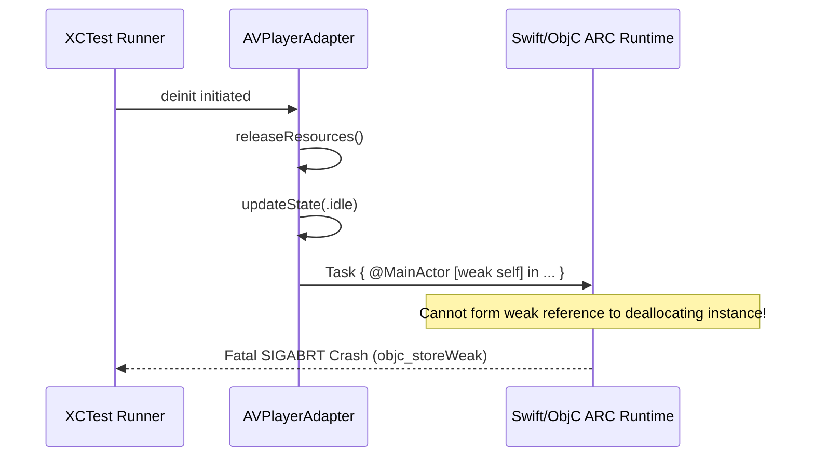
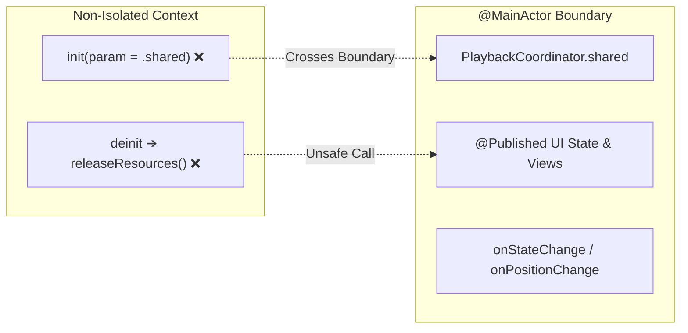
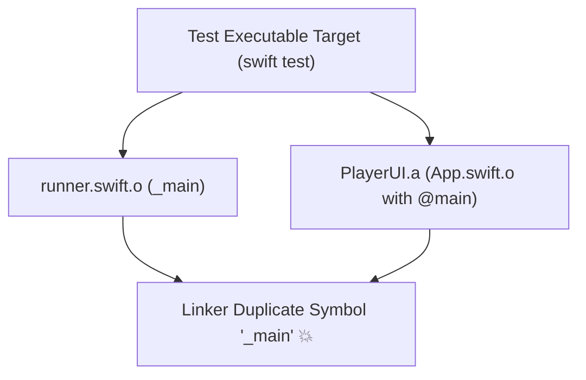
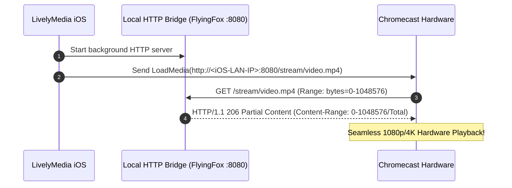

# Major Engineering Case Studies

This document provides detailed post-mortem analyses of critical architectural, concurrency, memory management, and pipeline breakthroughs resolved in LivelyMedia.

---

## Case M-01: ARC Deallocation Weak Reference Runtime Crash

### 1. Metadata
- **Subsystem**: `PlaybackEngine` (`AVPlayerAdapter.swift`, `KSPlayerAdapter.swift`)
- **Severity**: Critical (Fatal Runtime Crash during Unit Test Execution)
- **Error Signature**:
  ```
  objc[3525]: Cannot form weak reference to instance (0x13b6215f0) of class PlaybackEngine.AVPlayerAdapter. 
  It is possible that this object was over-released, or is in the process of deallocation.
  ```

### 2. Root Cause Analysis (RCA)
In the Objective-C / Swift ARC runtime (`objc_storeWeak` / `objc_initWeak`), it is illegal to create a new weak reference to an object that has entered its `deinit` lifecycle.
When `PlaybackCoordinator` or `AVPlayerAdapter` was deallocated at the end of `testPlaybackCoordinatorQueueNavigation`, its `deinit` invoked `releaseResources()`.



Inside `releaseResources()`, `updateState(.idle)` was being called, which in turn spawned an asynchronous `Task { @MainActor [weak self] in ... }`. The capture list `[weak self]` attempted to register a weak pointer to the deallocating instance, triggering an immediate runtime assertion.

### 3. Resolution
Decouple internal state reset from UI event broadcasting during deallocation:
1. In `releaseResources()`, directly mutate `self.state = .idle` instead of routing through `updateState()`.
2. Clear all KVO tokens (`statusObservation = nil`) and notification observers synchronously.

```diff
 public func releaseResources() {
     player.pause()
     if let token = timeObserverToken {
         player.removeTimeObserver(token)
         timeObserverToken = nil
     }
     statusObservation?.invalidate()
+    statusObservation = nil
     timeControlStatusObservation?.invalidate()
+    timeControlStatusObservation = nil
     NotificationCenter.default.removeObserver(self)
     player.replaceCurrentItem(with: nil)
-    updateState(.idle)
+    self.state = .idle
 }

 deinit {
     releaseResources()
 }
```

---

## Case M-02: Swift 6 Strict Concurrency & MainActor Isolation Hierarchy

### 1. Metadata
- **Subsystem**: `PlaybackEngine`, `CastEngine`, `PlayerUI`, `WebSnifferEngine`
- **Severity**: High (Compilation Failure with Strict Concurrency Checking)
- **Key Warnings / Errors**:
  - `Main actor-isolated property 'shared' can not be referenced from a default argument`
  - `Call to main actor-isolated closure from non-isolated synchronous context`
  - `Main actor-isolated method cannot be referenced from non-isolated deinitializer`

### 2. Root Cause Analysis (RCA)
Under Swift 6 / Swift 5.10 `-strict-concurrency=complete`, default parameter expressions (e.g., `init(coordinator: PlaybackCoordinator = .shared)`) are evaluated in the caller's isolation context. If the caller is non-isolated, accessing a `@MainActor`-isolated singleton `.shared` violates actor boundaries.

Furthermore, applying `@MainActor` to an entire class (e.g., `@MainActor class AVPlayerAdapter`) makes all its instance methods isolated to `@MainActor`, which causes `deinit` (always `nonisolated` in Swift) to fail when calling `releaseResources()`.



### 3. Resolution
1. **Dependency Injection with Optional Fallback**:
   Change default parameter declarations to `nil` and resolve them inside the initializer body on `@MainActor`:
   ```swift
   public init(coordinator: PlaybackCoordinator? = nil) {
       self.coordinator = coordinator ?? PlaybackCoordinator.shared
   }
   ```
2. **Explicit Closure Isolation**:
   Declare callbacks as `@MainActor @Sendable` and dispatch via `Task { @MainActor [weak self] in ... }` from non-isolated low-level engine threads:
   ```swift
   public var onStateChange: (@MainActor @Sendable (PlaybackState) -> Void)?
   public var onPositionChange: (@MainActor @Sendable (TimeInterval, TimeInterval) -> Void)?
   ```
3. **Class-Level Isolation Removal**:
   Remove `@MainActor` from `MediaPlayerProtocol`, `AVPlayerAdapter`, and `KSPlayerAdapter` classes so `deinit` remains valid, while isolating UI-bound coordinators (`PlaybackCoordinator`, `CastCoordinator`, `WebBrowserCoordinator`).

---

## Case M-03: Test Runner vs Library Target Duplicate `_main` Symbol Collision

### 1. Metadata
- **Subsystem**: `PlayerUI`, `Tests/`
- **Severity**: Critical (Mach-O Linker Error)
- **Error Signature**:
  ```
  duplicate symbol '_main' in:
      runner.swift.o (from SwiftPM Test Harness)
      App.swift.o (from PlayerUI target)
  ld: 1 duplicate symbol for architecture arm64 / x86_64
  clang: error: linker command failed with exit code 1
  ```

### 2. Root Cause Analysis (RCA)
`swift test` automatically compiles an internal test runner entrypoint (`runner.swift`) containing `@main`.
When `PlayerUI` was imported as a library dependency for `PlayerUITests`, it contained `App.swift` with `@main public struct LivelyMediaApp: App`. The linker attempted to link two distinct `@main` entrypoints into a single test executable.



### 3. Resolution
1. In `ios/Sources/PlayerUI/App.swift`, remove `@main` so `PlayerUI` acts as a pure reusable SwiftUI library.
2. Maintain `@main` exclusively in standalone executable app targets (`LivelyMedia.swiftpm/App.swift` for iPad Swift Playgrounds).

---

## Case M-04: Swift Playgrounds (`AppleProductTypes`) vs CLI Build Disconnect

### 1. Metadata
- **Subsystem**: `CI/CD` (`.github/workflows/ios_build.yml`), `LivelyMedia.swiftpm`
- **Severity**: High (CI Pipeline Failure)
- **Error Signature**:
  ```
  error: no such module 'AppleProductTypes'
  import AppleProductTypes
  ```

### 2. Root Cause Analysis (RCA)
`LivelyMedia.swiftpm` contains `import AppleProductTypes` in `Package.swift`, which is an Apple proprietary module embedded only inside the iPadOS/iOS Swift Playgrounds app and Xcode GUI.
When the GitHub Actions workflow executed `cd LivelyMedia.swiftpm && swift build`, the command-line `swift-build` toolchain could not locate `AppleProductTypes.framework`.

### 3. Resolution
Separate testing/compilation from distribution packaging in `.github/workflows/ios_build.yml`:
1. Build and test the full 11-module framework via `cd ios && swift test && swift build -c release`.
2. Package `LivelyMedia.swiftpm` as a pure directory asset bundle for iPad Playgrounds without invoking CLI `swift build` on it.
3. Generate the universal `.ipa` (Payload structure) for Sideloadly / AltStore distribution.

---

## Case M-05: 4K HEVC HDR Live Buffering & Dynamic Stream Cache Invalidation

### 1. Metadata
- **Subsystem**: `PlaybackEngine`, `Playgrounds App`
- **Severity**: Medium (Media Stalling & Video Playback Failures)
- **Symptoms**: Cinema 4K HDR demo failed to buffer or rendered black frames on iPad Air 5 (M1).

### 2. Root Cause Analysis (RCA)
- The initial 4K HDR test asset relied on an expiring Google Cloud Storage signed URL. When the session token lapsed, `AVPlayer` hung in `.waitingToPlayAtSpecifiedRate` indefinitely.
- The persistent media database cached obsolete stream URLs across app launches without validating HTTP reachability.

### 3. Resolution
1. Replaced expiring test URLs with permanent Apple CDN 4K HEVC HDR master playlists (`bipbop_adv_example_hevc/master.m3u8` and 1080p HLS streams).
2. Implemented dynamic cache sanitization: on application boot, invalid or expired remote URIs are purged and replaced with active CDN endpoints.

---

## Case M-06: Chromecast Sandbox Bypass via Embedded HTTP Range 206 Bridge

### 1. Metadata
- **Subsystem**: `CastEngine`, `TransferServer`
- **Severity**: High (Architectural Limitation of Google Cast on iOS)

### 2. Architectural Breakthrough
Chromecast hardware receivers (Google TV / Nest Hub) execute on an isolated LAN and have zero access to the iOS local application sandbox (`file:///var/mobile/...`).



### 3. Technical Implementation
1. Embedded `FlyingFox` lightweight async HTTP server listening on `:8080`.
2. Implemented `HTTP 206 Partial Content` streaming handler with `Content-Range`, `Accept-Ranges: bytes`, and dynamic byte chunking.
3. Developed `ChromecastStreamBridge` to resolve the device's local Wi-Fi IP and construct valid streaming URLs (`http://<local-ip>:8080/stream/<filename>`) dynamically for Google Cast receivers.
