# LivelyMedia Engineering Case Studies & Lessons Learned

## 1. Overview & Taxonomy
This directory serves as the engineering knowledge base and post-mortem archive for LivelyMedia iOS & iPadOS. It documents real-world technical challenges, root cause analyses (RCA), diagnostic methodologies, and definitive resolutions encountered during development and CI/CD automation.

Cases are categorized into **Major (Architecture, Concurrency, Memory, Toolchain)** and **Minor (API Evolution, Platform Availability, Syntax, UI Nuance)** levels.

---

## 2. Classification Matrix

```mermaid
graph TD
    Root["Engineering Case Studies"] --> Major["Major Impact Cases<br/>(Architecture, Memory, Concurrency, CI)"]
    Root --> Minor["Minor Impact Cases<br/>(API Migration, Syntax, Platform Compatibility)"]
    
    Major --> M1["M-01: ARC Deallocation Weak Reference Crash"]
    Major --> M2["M-02: Swift 6 Concurrency & Actor Isolation"]
    Major --> M3["M-03: Test Runner Linker Symbol Collision (_main)"]
    Major --> M4["M-04: Swift Playgrounds vs CLI Package Isolation"]
    Major --> M5["M-05: 4K HDR Dynamic Buffer & Cache Management"]
    Major --> M6["M-06: Local Network Chromecast HTTP 206 Bridge"]

    Minor --> m1["m-01: FlyingFox Async API Breaking Changes"]
    Minor --> m2["m-02: macOS Cross-Platform fullScreenCover Fallback"]
    Minor --> m3["m-03: GRDB Relational Query Label Syntax"]
    Minor --> m4["m-04: Swift Identifier Hyphenation Grammar"]
    Minor --> m5["m-05: Swift Tools Version Compatibility on Runners"]
    Minor --> m6["m-06: AVRoutePickerView Custom Overlay Integration"]
    Minor --> m7["m-07: 10-Band EQ Curve & Haptic Scrubber Math"]
```

---

## 3. Quick Reference Index

### Major Cases (`docs/case-studies/MAJOR_CASES.md`)
| Case ID | Subsystem | Issue Summary | Core Resolution |
| :--- | :--- | :--- | :--- |
| **[M-01](MAJOR_CASES.md#case-m-01-arc-deallocation-weak-reference-runtime-crash)** | `PlaybackEngine` | `objc_storeWeak` crash during `deinit` when calling asynchronous cleanup tasks | Decoupled state reset from task dispatching; direct assignment in `deinit` |
| **[M-02](MAJOR_CASES.md#case-m-02-swift-6-strict-concurrency--mainactor-isolation-hierarchy)** | `PlaybackEngine`, `CastEngine`, `PlayerUI` | Strict concurrency violations on default parameters (`.shared`) and callback escapes | Explicit `@MainActor` closure signatures and `nil` fallback dependency injection |
| **[M-03](MAJOR_CASES.md#case-m-03-test-runner-vs-library-target-duplicate-_main-symbol-collision)** | `PlayerUI`, `Tests` | Linker collision between Swift test harness `_main` and UI `@main` | Converted internal UI targets to pure libraries without `@main` attribute |
| **[M-04](MAJOR_CASES.md#case-m-04-swift-playgrounds-appleproducttypes-vs-cli-build-disconnect)** | `CI/CD`, `Playgrounds` | `AppleProductTypes` module import failure during pure CLI `swift build` | Separated modular compilation (`ios/`) from Playgrounds artifact packaging |
| **[M-05](MAJOR_CASES.md#case-m-05-4k-hevc-hdr-live-buffering--dynamic-stream-cache-invalidation)** | `PlaybackEngine`, `Playgrounds` | 4K HEVC sample buffering stalls caused by stale Google Storage session tokens | Switched to Apple CDN 4K HEVC master playlists with automatic cache flushing |
| **[M-06](MAJOR_CASES.md#case-m-06-chromecast-sandbox-bypass-via-embedded-http-range-206-bridge)** | `CastEngine`, `TransferServer` | Chromecast inability to access local sandboxed media files directly | Designed reverse streaming HTTP bridge responding with chunked `206 Partial Content` |

---

### Minor Cases (`docs/case-studies/MINOR_CASES.md`)
| Case ID | Subsystem | Issue Summary | Core Resolution |
| :--- | :--- | :--- | :--- |
| **[m-01](MINOR_CASES.md#case-m-01-flyingfox-016--026-async-api-evolution)** | `TransferServer` | `request.body` and `server.start()` compiler errors on FlyingFox 0.26+ | Migrated to `try await request.bodyData` and `try await server.run()` |
| **[m-02](MINOR_CASES.md#case-m-02-macos-runner-platform-incompatibility-for-fullscreencover)** | `PlayerUI` | `.fullScreenCover` unavailable on macOS runner test builds | Platform compilation guards `#if os(iOS)` with macOS `.sheet` fallback |
| **[m-03](MINOR_CASES.md#case-m-03-grdb-duplicate-parameter-label-syntax-error)** | `CoreStorageTests` | Compilation failure due to duplicated parameter labels `(in: playlistId:)` | Corrected call-site to match declaration `fetchMediaItems(in: playlist.id)` |
| **[m-04](MINOR_CASES.md#case-m-04-swift-identifier-constraint-violation-struct-wi-fiservertab)** | `LivelyMedia.swiftpm` | Invalid character `-` in Swift struct name `struct Wi-FiServerTab` | Renamed struct to alphanumeric standard `struct WiFiServerTab` |
| **[m-05](MINOR_CASES.md#case-m-05-swift-tools-version-mismatch-on-github-actions-runner)** | `CI/CD` | Swift 6.0.0 tools version rejected on Xcode 15.4 / Swift 5.10 runners | Set tools version to `5.9` with `.iOS("17.0")` for maximum cross-runner compatibility |
| **[m-06](MINOR_CASES.md#case-m-06-airplay-2-native-avroutepickerview-glassmorphism-integration)** | `PlayerUI` | Standard AirPlay button styling clashing with dark Obsidian theme | Wrapped `AVRoutePickerView` in `UIViewRepresentable` with custom tint overrides |
| **[m-07](MINOR_CASES.md#case-m-07-10-band-equalizer-preset-curve-synthesis--haptic-scrubbers)** | `PlayerUI` | Vertical touch slider precision and dB gain scaling responsiveness | Implemented normalized -12dB ~ +12dB mapping with master preset curves |

---

## 4. Documentation Standards
When recording new troubleshooting cases:
1. Include **Environment & Prerequisites** (iOS version, Swift version, compiler flags).
2. Detail the **Root Cause Analysis (RCA)** with exact compiler/runtime error traces.
3. Provide **Before & After Code Snippets**.
4. Define the **Prevention Protocol** to avoid regression.
